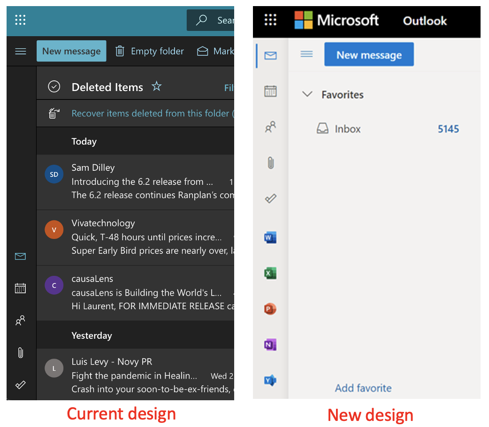
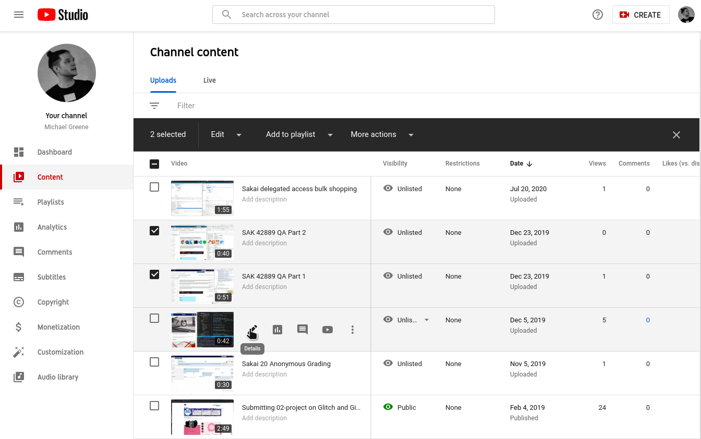
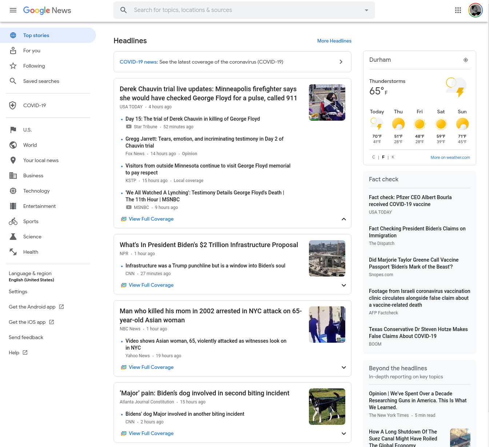

# Sakai Design Inspiration

[Sakai Community Figma](https://www.figma.com/files/team/959143738433153746/Sakai?fuid=959143257870176544)

[Bridgette's Design](https://app.zeplin.io/project/5e908a151a7bbd1f8f652225/dashboard?sid=5ec6c9a20aa7f22abc82c3c9)

[Chanelle's Design](https://sakailms.invisionapp.com/)

Old Google Workplace Chat UI

- I like the way the name is in the header bar and you can interact with it

New Google Workplace Chat UI

- makes a lot more sense in many ways but you lose that site name in the header bar

Google Apps right sidebar

Microsoft left sidebar

Canvas Discussions

Youtube Studio

Google News

[Material Design Dark theme](https://material.io/design/color/dark-theme.html)

[Apple Human Interface Guidelines Dark Mode](https://developer.apple.com/design/human-interface-guidelines/macos/visual-design/dark-mode/)

[Invision's Guide to Building an MVP Design System](https://drive.google.com/file/d/1r1wRj6TcQFL5c37a6Tb0BQQ1kMN_5wJV/view?usp=sharing)

[Form Design Patterns - Adam Silver - Smashing Magazine](https://www.sitepoint.com/premium/books/form-design-patterns/read/1)
